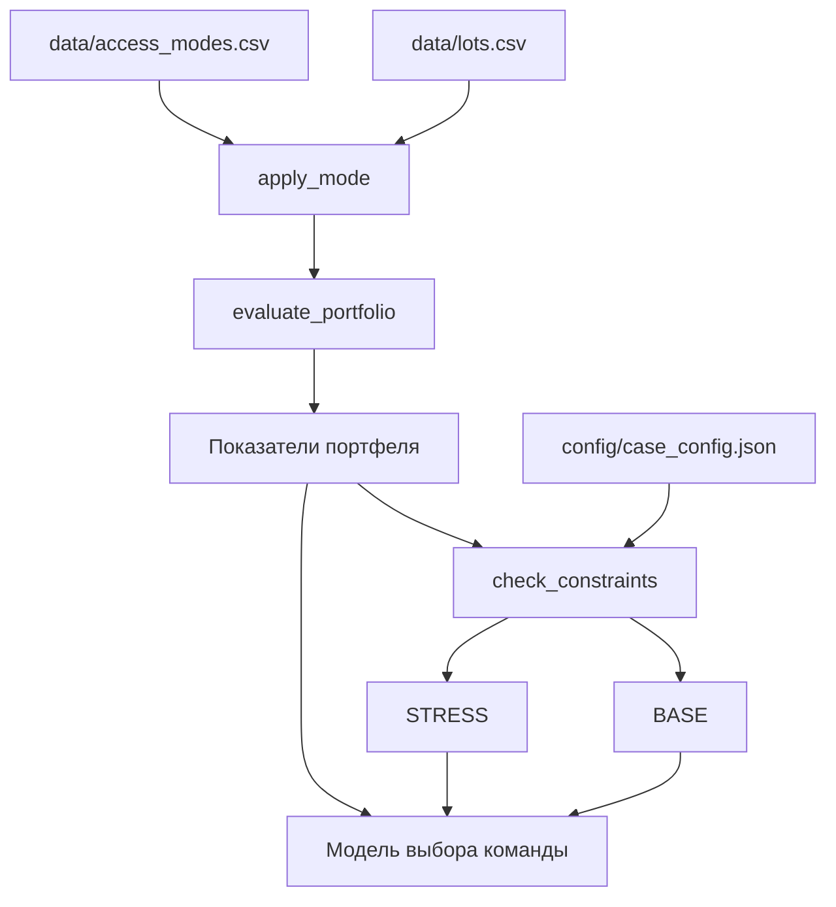
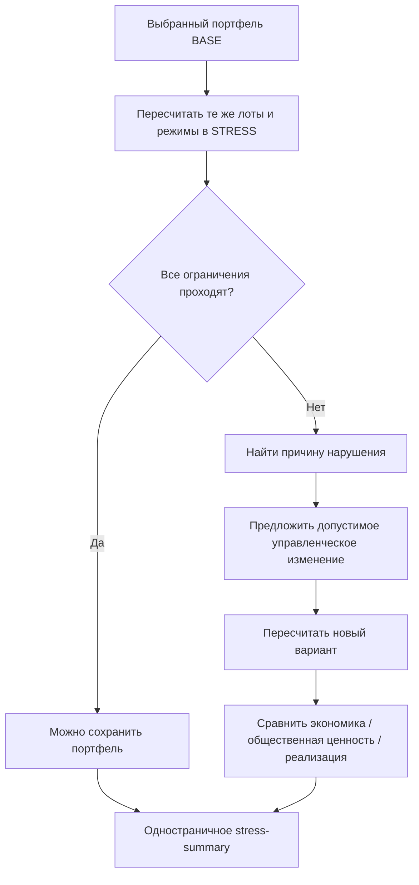

# Космос как инфраструктура: как работать с кейсом и не терять баллы на проверке

Этот репозиторий содержит кейс АНО «Исследовательский центр «Космическая экономика и политика» о межрегиональном портфеле космических сервисов общего пользования.

Задача команды шире, чем подобрать четыре строки из таблицы. Нужно предложить портфель, показать, какие региональные задачи он решает, посчитать экономику, проверить ограничения в базовом и стресс-сценарии, а затем объяснить, кто платит, кто пользуется сервисом, кто отвечает за эксплуатацию и как схема переживет сокращение стартового бюджета.

В этой инструкции две цели. Первая: сделать техническую часть воспроизводимой. Вторая: перевести критерии оценки в список проверяемых результатов, чтобы сильное решение не потеряло баллы из-за неочевидного поля, неописанного допущения или файла, который эксперт не смог запустить.

> Здесь нет «правильного портфеля» и нет скрытой формулы победителя. Канонический код считает заданный вариант и проверяет ограничения. Метод выбора, аргументация и управленческая схема остаются задачей команды.

## Содержание

1. [Что именно нужно сделать](#1-что-именно-нужно-сделать)
2. [Что лежит в репозитории](#2-что-лежит-в-репозитории)
3. [Быстрый старт](#3-быстрый-старт)
4. [Как устроен канонический расчет](#4-как-устроен-канонический-расчет)
5. [Исходные лоты: что означает каждое поле](#5-исходные-лоты-что-означает-каждое-поле)
6. [Режимы доступа A, B, C и пользовательский D](#6-режимы-доступа-a-b-c-и-пользовательский-d)
7. [Все ограничения BASE и STRESS](#7-все-ограничения-base-и-stress)
8. [Поля template](#Космос_как_инфраструктура.ipynb)
9. [Как строить решение, а не только расчет](#9-как-строить-решение-а-не-только-расчет)
10. [Границы доступа](#10-границы-доступа)
11. [Стресс-сценарий](#11-стресс-сценарий)
12. [Карта 100 баллов](#12-карта-100-баллов)
13. [Что должно лежать в финальном репозитории команды](#13-что-должно-лежать-в-финальном-репозитории-команды)
14. [Проверка перед защитой](#14-проверка-перед-защитой)
15. [Типовые ошибки](#15-типовые-ошибки)
16. [Литература](#16-литература-и-открытые-полные-тексты)

---

## 1. Что именно нужно сделать

Если свести постановку к одному рабочему циклу, получится такая схема:


На выходе от команды ожидаются три связанных результата:

- управленческая записка на 8-12 страниц и отдельное одностраничное резюме стресс-сценария;
- работающий программный расчетный инструмент с исходным кодом, данными, настройками и инструкцией запуска;
- презентация до 12 слайдов. На защите нужно показать живой пересчет, изменение параметров и проверку ограничений.

Важная связка: цифры в записке, цифры в презентации и цифры, которые получает эксперт после запуска кода, должны совпадать. Если текст говорит одно, а инструмент после изменения входа показывает другое, эксперт будет оценивать проверяемый результат, а не намерение команды.

### Что не требуется

Кейс не просит проектировать спутник, наземную станцию или полноценную промышленную ИТ-систему. Не требуется заключать реальные договоры, запускать сервисы или строить универсальную платформу «на все случаи». Автоматический оптимизатор тоже не обязателен.

Нужно другое: прозрачная модель выбора, работающий пересчет, понятные ограничения и реалистичная схема внедрения.

---

## 2. Что лежит в репозитории

На момент подготовки этой инструкции в `main` есть четыре части:

```text
.
├── README.md
├── case_core.py
├── config/
│   └── case_config.json
└── data/
    ├── lots.csv
    └── access_modes.csv
```

### [`case_core.py`](./case_core.py)

Канонический расчетный слой. В нем четыре ключевые функции:

| Функция | Что делает |
|---|---|
| `load_case(root)` | Загружает лоты, режимы доступа и конфигурацию |
| `apply_mode(lot, mode)` | Применяет коэффициенты режима доступа к одному лоту |
| `evaluate_portfolio(selection, lots, modes, config)` | Считает показатели выбранного портфеля |
| `check_constraints(metrics, config, scenario)` | Проверяет формальные ограничения для `BASE` или `STRESS` |

В начале файла прямо зафиксирован принцип: исходные входы нельзя менять незаметно. Поверх канонического слоя команда вправе строить собственную модель принятия решений.

### [`data/lots.csv`](./data/lots.csv)

Восемь исходных сервисных лотов с параметрами затрат, поступлений, общественной ценности и несколькими индексами.

### [`data/access_modes.csv`](./data/access_modes.csv)

Три канонических режима `A`, `B`, `C`. В таблице заданы коэффициенты, которые меняют расчетные параметры лота.

### [`config/case_config.json`](./config/case_config.json)

Версия кейса `1.1`, общие ограничения и два лимита стартовых затрат:

- `BASE`: `c0_max_mrub = 1300`;
- `STRESS`: `c0_max_mrub = 1180`.


---

## 3. Быстрый старт

### Вариант A. Google Colab

Стартовый notebook рассчитан на Colab. Первая bootstrap-ячейка ищет файлы кейса локально, а если не находит, клонирует:

```text
https://github.com/SpaceEconomyPolicy/test.git
```

Дальше она импортирует `case_core.py` и загружает `lots.csv`, `access_modes.csv`, `case_config.json`.

Что делать участнику:

1. Открыть предоставленный `Космос_как_инфраструктура.ipynb` в Colab.
2. Запустить bootstrap-ячейку.
3. Убедиться, что появились таблица лотов и строка с найденным `CASE ROOT`.
4. Заполнять параметры сверху вниз.

Есть одна техническая мелочь. Если каталог `/content/kep_case` уже существует и содержит требуемые файлы, bootstrap не выполняет `git pull`. После обновления исходного репозитория проще запустить notebook в свежем runtime или удалить старый `/content/kep_case`, затем снова выполнить первую ячейку.

### Вариант B. Локально

Для канонического слоя нужен `pandas`; template также импортирует `numpy` и предполагает среду Jupyter.

```bash
git clone https://github.com/SpaceEconomyPolicy/test.git
cd test
python -m pip install pandas numpy jupyter
jupyter lab
```

Минимальная версия Python в текущих материалах кейса отдельно не зафиксирована. Поэтому не стоит писать в своей документации произвольное «Python >= X.Y», если вы сами это не проверили. Зафиксируйте ту версию, на которой реально тестировали свое решение.

### Дымовая проверка без поиска портфеля

Можно проверить загрузку и одну строку. Такой пример намеренно неполный и не подсказывает готовое конкурсное решение:

```python
from case_core import load_case, evaluate_portfolio, check_constraints

lots, modes, config = load_case('.')

selection = [('FIRE', 'A')]
detail, metrics = evaluate_portfolio(selection, lots, modes, config)

print(detail)
print(metrics)
print(check_constraints(metrics, config, scenario='BASE'))
```

`exact_lot_count` здесь должен быть `False`, потому что полный портфель по условиям содержит ровно четыре уникальных лота.

---

## 4. Как устроен канонический расчет

Канонический слой не ранжирует команды и не выбирает портфель. Он отвечает на более узкий вопрос: «Если взять такие лоты и такие режимы, какие показатели получатся и проходят ли они формальные ограничения?»



### 4.1. Формулы для одного лота

Для выбранного лота берутся исходные параметры и коэффициенты режима доступа:

```text
c0 = c0_source * k_c0

opex = opex_source * k_opex

vpub = vpub_source * k_vpub

cash = anchor_cash_source * k_anchor
     + commercial_cash_source * k_commercial
```

Где:

- `c0` измеряется в млн руб.;
- `opex` в млн руб. в год;
- `vpub` в млн руб. в год по синтетической шкале общественной ценности кейса;
- `cash` в млн руб. в год.

`vpub` нельзя трактовать как еще один денежный доход. По постановке общественная ценность и денежные поступления должны идти раздельно. Нельзя написать `общий эффект = cash + vpub` и назвать результат выручкой или свободным денежным потоком.

### 4.2. Агрегация портфеля

Для выбранных строк код считает:

```text
C0_portfolio = сумма c0
OPEX_portfolio = сумма opex
VPUB_portfolio = сумма vpub
CASH_portfolio = сумма cash
KCASH = CASH_portfolio / OPEX_portfolio
```

Средними арифметическими считаются:

```text
t_rep
readiness_1_5
resilience_1_5
scale_1_5
```

Еще три показателя считаются как количества:

- число разных территориальных архетипов среди нефедеральных лотов;
- число разных capability groups;
- число лотов, у которых выбранный режим имеет `public_core = true`.

### 4.3. Что такое `kcash`

В коде это только отношение годовых денежных поступлений к годовому OPEX:

```text
kcash = cash_mrub_per_year / opex_mrub_per_year
```

Это не прибыль, не IRR, не NPV, не ROI и не срок окупаемости. Если команда вводит свои инвестиционные показатели, их нужно описать отдельными формулами и не выдавать за канонический `kcash`.

### 4.4. Что каноническая модель не считает

В текущем `case_core.py` нет:

- дисконтирования и ставки дисконтирования;
- NPV, IRR и срока окупаемости;
- налогов;
- помесячного или поквартального графика денежных потоков;
- вероятностной модели спроса;
- SLA, штрафов и качества сервиса;
- стоимости переключения поставщика;
- явного горизонта планирования.

Постановка требует указывать период расчета, но в текущем `case_config.json` отдельного параметра горизонта нет. Канонический слой работает со стартовым `c0` и годовыми величинами. Если команда добавит многолетнюю модель, это нормальное развитие решения, но горизонт и новые допущения надо назвать своими, указать источники и показать, как они связаны с исходными параметрами.

---

## 5. Исходные лоты: что означает каждое поле

В `lots.csv` восемь строк:

| ID | Территориальный архетип | Сервис | Capability groups | Federal |
|---|---|---|---|---|
| `FIRE` | `Siberian` | мониторинг лесных пожаров Сибири | `EO` | false |
| `FLOOD` | `FarEast` | мониторинг паводков и оползней | `EO` | false |
| `AGRI` | `South` | сельскохозяйственная аналитика | `EO;PNT/InSAR` | false |
| `INFRA` | `UralVolga` | мониторинг деформаций инфраструктуры | `PNT/InSAR` | false |
| `ARCTIC` | `Arctic` | поддержка удаленной логистики | `SATCOM;PNT/InSAR` | false |
| `TRANS` | `Central` | мониторинг транспорта | `PNT/InSAR;EO` | false |
| `ENV` | `VolgaCaspian` | экологический мониторинг | `EO` | false |
| `SSA` | `Federal` | space situational awareness | `SSA` | true |

Числовые значения лучше читать непосредственно из [`data/lots.csv`](./data/lots.csv), чтобы у команды не было второй ручной копии исходных данных.

### Справочник полей `lots.csv`

| Поле | Как его читать в модели | Единица / формат | Важная оговорка |
|---|---|---|---|
| `lot_id` | уникальный идентификатор лота | строка | используется при выборе портфеля |
| `territorial_archetype` | территориальный архетип, к которому относится нефедеральный сервис | строка | федеральные лоты не входят в счетчик территориальных архетипов |
| `service` | краткое название сервиса | строка | само название не заменяет анализ пользователей и потребности |
| `capability_groups` | группы космических возможностей | строки через `;` | `PNT`, `InSAR`, `PNT/InSAR` нормализуются в одну группу `PNT/InSAR` |
| `c0_mrub` | исходная величина стартовых затрат до коэффициента режима | млн руб. | в стресс-сценарии исходная стоимость сама по себе не должна «сжиматься» из-за нового бюджетного лимита |
| `opex_mrub_per_year` | исходные годовые эксплуатационные расходы | млн руб./год | после выбора режима умножаются на `k_opex` |
| `anchor_cash_mrub_per_year` | исходные годовые денежные поступления из якорной компоненты | млн руб./год | файл не называет конкретного плательщика; команда должна связать поток со своей финансовой схемой |
| `commercial_cash_mrub_per_year` | исходные годовые коммерческие поступления | млн руб./год | после режима умножаются на `k_commercial` |
| `vpub_mrub_per_year` | синтетическая оценка общественной ценности | млн руб./год по шкале кейса | не складывать с выручкой как с одним денежным потоком |
| `t_rep` | канонический безразмерный показатель с порогом на уровне портфеля | число | точная содержательная расшифровка `t_rep` в текущих файлах репозитория не дана; не подменяйте ее догадкой |
| `readiness_1_5` | индекс готовности | 1-5 | методика построения индекса в текущих файлах не раскрыта |
| `resilience_1_5` | индекс устойчивости | 1-5 | канонический код только усредняет его |
| `scale_1_5` | индекс масштабируемости/тиражируемости в исходной таблице | 1-5 | код усредняет; управленческое объяснение тиражирования команда делает сама |
| `federal` | признак федерального лота | boolean | `true` исключает строку из счетчика территориальных архетипов |

Последние четыре индекса не надо «додумывать» до подробной методологии, которой нет в исходных файлах. Их можно использовать как заданные синтетические входы. Если команда переопределяет смысл или строит поверх них новый индекс, это уже собственная модель и ее придется объяснить.

---

## 6. Режимы доступа A, B, C и пользовательский D

### 6.1. Что точно задано в репозитории

`access_modes.csv` содержит только коэффициенты. Содержательные названия вроде «бесплатный», «коммерческий» или «гибридный» в текущем файле не заданы, поэтому инструкция их не придумывает.

| Режим | `k_c0` | `k_opex` | `k_vpub` | `k_anchor` | `k_commercial` | `public_core` |
|---|---:|---:|---:|---:|---:|---|
| `A` | 1.05 | 1.05 | 1.00 | 1.00 | 0.25 | true |
| `B` | 1.00 | 1.00 | 0.82 | 0.80 | 0.70 | false |
| `C` | 0.98 | 0.95 | 0.62 | 0.45 | 0.95 | false |

Пример чтения режима `A`: стартовые затраты и OPEX становятся на 5% выше исходных, общественная ценность сохраняется на уровне 100%, якорная денежная компонента на уровне 100%, коммерческая на уровне 25%. Только `A` из трех канонических режимов помечен `public_core = true`.

### 6.2. Что означает режим для проверки ограничений

В `case_core.py` режим влияет только на пять числовых параметров и флаг `public_core`. Сам код не знает:

- кто имеет право пользоваться сервисом;
- нужен ли логин;
- где проходит территориальная граница доступа;
- есть ли бесплатный базовый слой и платные дополнительные функции;
- кто закупает сервис;
- кто оператор;
- какие SLA, лицензии, права на данные и правила повторного использования действуют;
- как делятся риски между заказчиком и поставщиком.

Эти вещи оцениваются как управленческая схема. Их надо описать отдельно и состыковать с коэффициентами, которые вы выбрали.

### 6.3. Пользовательский режим `D`

Template дает возможность добавить собственный режим `D`. Это не свободная кнопка «подогнать ответ». В комментарии notebook прямо сказано, что режим должен опираться на причинную логику и sensitivity-анализ. Если `D` помечается как `public_core`, базовый общественно значимый слой должен оставаться доступным без дискриминации.

Notebook добавляет строку `D` только если `enable_custom_mode = True`.

Технический нюанс: выпадающие списки выбора портфеля все равно показывают `D`. Если выбрать `D`, но не включить `enable_custom_mode`, `evaluate_portfolio` завершится ошибкой `Unknown mode: D`.

---

## 7. Все ограничения BASE и STRESS

Формальные проверки находятся в `check_constraints()`.

| Код проверки | Условие | Простыми словами |
|---|---|---|
| `exact_lot_count` | `selected_lots == 4` | ровно четыре уникальных лота |
| `territorial_archetypes` | `>= 3` | не меньше трех территориальных архетипов среди нефедеральных лотов |
| `capability_groups` | `>= 2` | не меньше двух разных capability groups |
| `public_core_lots` | `>= 2` | не меньше двух выбранных строк с режимом `public_core = true` |
| `c0_limit` BASE | `c0 <= 1300` | стартовые затраты портфеля в базовом сценарии не выше 1300 млн руб. |
| `c0_limit` STRESS | `c0 <= 1180` | тот же показатель в стресс-сценарии не выше 1180 млн руб. |
| `opex_limit` | `opex <= 360` | годовой OPEX не выше 360 млн руб. |
| `vpub_floor` | `vpub >= 1000` | годовая общественная ценность не ниже 1000 млн руб. по шкале кейса |
| `kcash_floor` | `kcash >= 0.6` | денежные поступления покрывают не меньше 60% годового OPEX по формуле `cash / opex` |
| `t_rep_floor` | `t_rep >= 0.63` | среднее `t_rep` по выбранным лотам не ниже 0.63 |

### Граничные значения

Числовые ограничения по `c0`, `opex`, `vpub`, `kcash`, `t_rep` включают саму границу. Например:

- `c0 = 1300` проходит `BASE`;
- `c0 = 1180` проходит `STRESS`;
- `opex = 360` проходит;
- `vpub = 1000` проходит;
- `kcash = 0.6` проходит;
- `t_rep = 0.63` проходит.

Для сравнений в коде используется технический допуск `1e-9`, чтобы микроскопическая погрешность float не превращала равенство в случайный провал.

### Что меняется в STRESS

В конфигурации версии 1.1 меняется только `c0_max_mrub`: с 1300 до 1180. Остальные формальные пороги остаются теми же.

Это принципиально. Стресс-сценарий не разрешает автоматически уменьшить исходные `c0` лотов на 9,2% только потому, что бюджет стал меньше. Сначала проверяется исходное решение при новом лимите. Если оно не проходит, команда предлагает управленческое действие и объясняет его.

---

## 8. Поля template [`Космос_как_инфраструктура.ipynb`](./Космос_как_инфраструктура.ipynb)

Ниже не «советы по интерфейсу», а фактическое описание полей из предоставленного template и того, что делают соответствующие ячейки. Чтобы открыть файл .ipynb в браузере, нужно его скачать, зайти на сайт [`Google Colab `](https://colab.research.google.com), перетащить файл .ipynb в окно приветствия или загрузить его через меню «Файл» -> «Загрузить блокнот».

### 8.1. Карточка решения команды

#### `team_name`

Тип: строка.

Что вводить: название команды.

Что делает код: только печатает значение и затем сохраняет его в `results/team_decision_config.json`.

На расчет портфеля не влияет.

#### `decision_method`

Тип: выпадающий список.

Доступные значения:

```text
Weighted MCDA
Pareto/frontier
Rule-based/manual
Optimization
Other
```

Что означает поле: команда сообщает, каким способом она принимает решение поверх канонических расчетов.

Что делает template: сам выбор строки не запускает MCDA, Pareto-анализ или оптимизацию. Это метаданные. Настоящий алгоритм команда должна реализовать и объяснить сама.

Как не потерять П2 и П4:

- для `Weighted MCDA` опишите критерии, направление каждого показателя, нормализацию, веса и проверку чувствительности;
- для `Pareto/frontier` объясните, какие критерии участвуют и почему вариант считается недоминируемым;
- для `Rule-based/manual` заранее зафиксируйте правила, чтобы выбор не выглядел как решение «на глаз» после просмотра результата;
- для `Optimization` покажите переменные решения, целевую функцию, ограничения и способ решения;
- для `Other` дайте алгоритм настолько явно, чтобы другой человек смог повторить выбор.

#### `strategy_thesis`

Тип: строка.

Что вводить: короткую управленческую гипотезу портфеля. Лучше одна-две содержательные фразы: какую потребность вы ставите в центр, какой компромисс принимаете и за счет чего обеспечиваете устойчивость.

Что делает код: печатает текст и экспортирует его в `team_decision_config.json`. В расчетах не участвует.

Плохой вариант: «создаем инновационную экосистему будущего».

Полезный вариант по форме, без подсказки конкретного ответа: «приоритет отдаем сервисам, которые закрывают X, при этом держим OPEX ниже Y и не теряем Z; доходную часть строим через ...». Числа и логика должны быть вашими.

### 8.2. Пользовательский режим доступа D

#### `enable_custom_mode`

Тип: boolean.

`False`: используется только исходная таблица режимов A/B/C.

`True`: notebook добавляет строку `D` в рабочий DataFrame `modes_work`.

Само включение не доказывает допустимость режима. Обоснование остается за командой.

#### `custom_mode_name`

Тип: строка.

Что вводить: понятное команде название собственного режима.

Что делает текущая ячейка: записывает значение в колонку `name_ru` новой строки `D` внутри `modes_work`. Каноническая `apply_mode()` эту колонку не читает: для расчета нужны `mode_id`, коэффициенты и `public_core`. Название не меняет формулы.

#### `k_c0_D`

Тип: число. В template начальное значение `None`.

Формула:

```text
c0_D = c0_source * k_c0_D
```

`1.00` оставляет исходный `c0`, `1.05` увеличивает на 5%, `0.95` уменьшает на 5%.

Если включить D и оставить `None`, расчет с D не сможет корректно преобразовать значение в `float`.

#### `k_opex_D`

Тип: число. В template начальное значение `None`.

Формула:

```text
opex_D = opex_source * k_opex_D
```

Нужно объяснить причинную связь. Например, снижение OPEX не может появиться только из желания пройти лимит; команда должна показать, какое изменение организации сервиса снижает затраты и что при этом происходит с качеством, доступностью и риском.

#### `k_vpub_D`

Тип: число. В template начальное значение `0`.

Формула:

```text
vpub_D = vpub_source * k_vpub_D
```

Осторожно: если включить D и забыть поменять это поле, общественная ценность выбранного лота в D станет нулевой. Это не «нейтральное значение по умолчанию».

#### `k_anchor_D`

Тип: число. Начальное значение `None`.

Влияет на якорную часть денежных поступлений:

```text
anchor_component_D = anchor_cash_source * k_anchor_D
```

#### `k_commercial_D`

Тип: число. Начальное значение `None`.

Влияет на коммерческую часть:

```text
commercial_component_D = commercial_cash_source * k_commercial_D
```

Полный `cash` для D:

```text
cash_D = anchor_cash_source * k_anchor_D
       + commercial_cash_source * k_commercial_D
```

#### `custom_public_core`

Тип: boolean.

Что делает код: записывает флаг `public_core` для режима D. Если `True`, каждый выбранный лот в режиме D увеличивает `public_core_lots` на единицу.

Что это не делает: флаг сам по себе не описывает общественный доступ. Если команда ставит `True`, в управленческой части нужно определить базовый слой сервиса, получателей, условия доступа и общественные обязательства.

#### `custom_mode_rationale`

Тип: строка.

Что вводить: объяснение, откуда взялись коэффициенты D и почему такая схема доступа реалистична. Ячейка записывает этот текст в колонку `description` строки D; `apply_mode()` его не использует.

Хорошая структура объяснения:

```text
изменение режима -> организационный механизм -> изменение затрат/поступлений/ценности -> риск -> как проверяем допущение
```

Template не валидирует качество этого текста и не ограничивает коэффициенты содержательно. Это не означает, что любое число разрешено условиями кейса.

### 8.3. Выбор четырех лотов

Поля:

| Поле | Что задает |
|---|---|
| `lot_1` | лот в первой позиции портфеля |
| `lot_2` | лот во второй позиции портфеля |
| `lot_3` | лот в третьей позиции портфеля |
| `lot_4` | лот в четвертой позиции портфеля |

Варианты:

```text
""
FIRE
FLOOD
AGRI
INFRA
ARCTIC
TRANS
ENV
SSA
```

Пустая строка означает, что позиция не заполнена.

Нужно выбрать четыре уникальных лота. Template собирает непустые позиции в `selection`. Если один и тот же `lot_id` повторен, notebook выводит предупреждение, а канонический показатель `selected_lots` считает уникальные ID через `nunique()`. Проверка «ровно 4» тогда провалится.

### 8.4. Режим для каждого выбранного лота

Поля:

| Поле | К какой позиции относится |
|---|---|
| `mode_1` | режим для `lot_1` |
| `mode_2` | режим для `lot_2` |
| `mode_3` | режим для `lot_3` |
| `mode_4` | режим для `lot_4` |

Варианты:

```text
A
B
C
D
```

Начальное значение в template: `C`.

Каждый `mode_i` относится к `lot_i` той же позиции. Например, `lot_2` считается с `mode_2`.

Не воспринимайте четыре буквы как четыре независимых «настройки бюджета». Режим меняет сразу несколько величин через таблицу коэффициентов. Поэтому выбор нужно объяснять как модель доступа, а не как локальную скидку.

Еще раз про D: он виден в списке даже при `enable_custom_mode = False`. Такой выбор приведет к `Unknown mode: D`.

### 8.5. Веса модели команды

Template содержит восемь полей:

```text
w_vpub
w_capex
w_opex
w_kcash
w_trep
w_readiness
w_resilience
w_scale
```

Они собираются в словарь:

```python
weights = {
    'vpub': w_vpub,
    'capex': w_capex,
    'opex': w_opex,
    'kcash': w_kcash,
    't_rep': w_trep,
    'readiness': w_readiness,
    'resilience': w_resilience,
    'scale': w_scale,
}
```

#### Что означает каждый вес

| Поле | Показатель, которому команда задает важность |
|---|---|
| `w_vpub` | общественная ценность `vpub_mrub_per_year` |
| `w_capex` | стартовые затраты `c0_mrub` |
| `w_opex` | годовой `opex_mrub_per_year` |
| `w_kcash` | коэффициент `cash / opex` |
| `w_trep` | средний канонический `t_rep` |
| `w_readiness` | средний `readiness_1_5` |
| `w_resilience` | средний `resilience_1_5` |
| `w_scale` | средний `scale_1_5` |

#### Критический нюанс `None`

Все восемь полей в стартовом template заданы как `None`. Следом ячейка выполняет:

```python
sum(weights.values())
```

Если хотя бы один вес остался `None`, Python выдаст `TypeError`. Поэтому перед запуском этой ячейки заполните все восемь числовыми значениями. Если какой-то критерий не используется, технически можно поставить `0` и объяснить почему.

Если выбран `Weighted MCDA`, template дополнительно проверяет, близка ли сумма весов к 1, и выводит предупреждение при отклонении.

#### Чего template не делает

Он не считает итоговый MCDA-score. Нет нормализации показателей, нет смены знака для затрат, нет ранжирования альтернатив. Поля лишь фиксируют веса команды.

Это специально оставленное пространство для решения. Если вы выбрали MCDA, реализуйте оценку полностью. Нельзя взять несопоставимые рубли, индексы 1-5 и коэффициент `kcash`, умножить на веса «как есть» и назвать это научно обоснованным рейтингом. Сначала нужна нормализация и направление предпочтения.

### 8.6. Поля sensitivity-проверки

| Поле | Что выбирает |
|---|---|
| `sensitivity_weight_1` | первый вес, для которого template показывает диапазон ±20% |
| `sensitivity_weight_2` | второй вес, для которого template показывает диапазон ±20% |

Варианты для каждого:

```text
vpub
capex
opex
kcash
t_rep
readiness
resilience
scale
```

Начальное значение обоих полей: `scale`.

Что делает текущая ячейка: берет выбранный базовый вес и печатает диапазон от `0.8 * weight` до `1.2 * weight`.

То есть это только заготовка диапазона ±20%. Ячейка не пересчитывает итоговый score, не нормирует оставшиеся веса и не показывает, меняется ли лидер.

Для содержательного sensitivity-анализа команда должна сама показать, что происходит с ранжированием/выбором при изменении значимых предпосылок. Если оба поля оставить `scale`, вы дважды проверите один и тот же вес.

Если выбранный вес остался `None`, операция умножения тоже завершится `TypeError`.

### 8.7. Управленческие поля

Эти поля не входят в арифметику, но напрямую помогают закрыть продуктовые критерии.

#### `payer_opex`

Ответьте: кто покрывает эксплуатационные расходы после запуска, за что именно он платит, из какого источника идут деньги и когда.

Полезно связать ответ с `cash_mrub_per_year` и показать, какая часть OPEX остается непокрытой денежными поступлениями и чем она финансируется.

Критерий: прежде всего П3.

#### `operator_model`

Опишите операционную и договорную схему: кто заказчик, оператор, поставщик, приемщик результата, пользователь; кто отвечает за данные, качество, SLA и непрерывность.

Критерий: прежде всего П5.

#### `supplier_switch_rule`

Нужен не лозунг «поддерживаем конкуренцию», а правило смены поставщика. Что считается триггером? Истечение контракта, нарушение SLA, цена выше порога, технологическая несовместимость, отказ от передачи данных? Что должно быть подготовлено заранее, чтобы смена была возможна: форматы данных, API, права на историю, документация, резервная схема?

Критерий: П7.

#### `replicable_core`

Опишите, что переносится из региона в регион без полной пересборки: данные, аналитический pipeline, API, контракты, регламенты, модели, интерфейсы, методика KPI или другое ядро.

Критерий: П8.

#### `local_adaptation`

Опишите, что неизбежно меняется на месте: источники региональных данных, пороги оповещения, интеграции, картография, процессы органов власти, языки/форматы отчетности, требования к связи, локальные подрядчики.

Не перечисляйте все возможные варианты. Свяжите адаптацию с выбранными лотами и конкретными регионами.

Критерий: П8.

#### `stress_decision`

Коротко зафиксируйте управленческий ответ на сокращение лимита `c0`: портфель сохраняется или пересматривается, что именно меняется и почему.

Затем подтвердите это цифрами. Сам текст ничего не пересчитывает.

Критерий: П6.

### 8.8. Экспорт результатов

Последняя ячейка при корректно выбранных четырех уникальных лотах создает:

```text
results/portfolio_detail.csv
results/portfolio_metrics.json
results/team_decision_config.json
```

В `team_decision_config.json` сохраняются:

- название команды;
- метод принятия решения;
- тезис стратегии;
- выбранные пары `(lot_id, mode_id)`;
- веса;
- управленческие поля.

Есть важный пробел template: параметры собственного режима D (`custom_mode_name`, коэффициенты, `custom_public_core`, `custom_mode_rationale`) в `team_decision_config.json` не экспортируются. Если команда использует D, сохраните эти значения в отдельном конфигурационном файле или расширьте экспорт. Иначе по одному `selection = [..., ('LOT', 'D'), ...]` эксперт не восстановит, что именно означал D в вашем запуске. Это напрямую затрагивает воспроизводимость и прослеживаемость допущений.

Техническая особенность: `results` создается относительно текущей рабочей директории notebook, а не относительно переменной `ROOT` репозитория. В Colab это может оказаться `/content/results`. Экспорт не делает `git commit` и не переносит файлы в финальный репозиторий автоматически. Проверьте путь и заберите результаты в свой submission.

---

## 9. Как строить решение, а не только расчет

Критерии специально разделяют «модель работает» и «решение обосновано». Поэтому хороший workflow похож на исследовательскую работу.

### Шаг 1. Начните с потребности, а не с баллов лота

Для каждого кандидата ответьте на четыре вопроса:

```text
кто пользователь -> какая проблема -> какое решение дает сервис -> как измеряется эффект
```

Пример структуры, без заполнения содержания за команду:

| Элемент | Что фиксировать |
|---|---|
| Пользователь | конкретный тип организации/службы/бизнеса |
| Решение | какое действие пользователь сможет принять благодаря сервису |
| Результат | что изменится в процессе или качестве решения |
| Общественный эффект | почему это важно для региона/группы получателей |
| Метрика | как проверить эффект после запуска |
| Источник данных | откуда возьмется факт для KPI |

Это защищает от распространенной ошибки: назвать `vpub` общественной ценностью и на этом закончить П1.

### Шаг 2. Соберите несколько сопоставимых вариантов

Не сравнивайте один хороший портфель с двумя явно плохими «для галочки». Альтернативы должны быть правдоподобными и считаться по одним правилам.

Для каждого варианта храните как минимум:

- состав лотов и режимы;
- `c0`, OPEX, `vpub`, cash, `kcash`, `t_rep`;
- число территориальных архетипов, capability groups, public-core лотов;
- статусы всех ограничений;
- readiness, resilience, scale;
- краткое объяснение компромисса.

### Шаг 3. Отделите канонический расчет от собственного критерия выбора

Хорошая архитектура выглядит так:


Это удобно и для защиты. Эксперт видит, где заканчиваются данные организаторов и начинаются ваши решения.

### Шаг 4. Если используете MCDA, задайте математику полностью

Восемь весов из template сами по себе не образуют MCDA.

Минимально нужно определить:

1. какие критерии входят в score;
2. где «больше лучше», а где «меньше лучше»;
3. как нормируются разные единицы;
4. как выбраны веса;
5. как обрабатываются недопустимые портфели;
6. насколько итог устойчив к изменениям весов и ключевых предпосылок.

Один из возможных общих видов:

```text
score(p) = sum_i w_i * z_i(p)
```

Здесь `z_i(p)` не должен быть сырым `c0` или сырым `vpub`, если рядом стоят показатели другого масштаба. Способ нормализации выбирает команда и обосновывает его.

### Шаг 5. Финансовая схема должна объяснять строки модели

Удобная карта:


Денежная стрелка и общественная ценность здесь разные вещи. Иногда получатель пользы вообще ничего не платит. Для инфраструктурного сервиса это нормально, если финансирование объяснено.

### Шаг 6. Зафиксируйте ограничения модели

Сильная записка не делает вид, что модель знает больше исходных данных. Пример честных границ:

- годовые поступления в case dataset не задают помесячную кассовую динамику;
- `vpub` дан синтетически, а не получен из реальной оценки willingness-to-pay;
- индексы readiness/resilience/scale даны как исходные баллы без методологии в текущем репозитории;
- режимы A/B/C заданы коэффициентами, но их договорное содержание нужно спроектировать;
- `t_rep` используется в ограничении, но его полная расшифровка в текущих файлах не приложена.

Такие оговорки не ослабляют модель. Они показывают, где заканчивается проверяемый вывод.

---

## 10. Границы доступа

В кейсе слово «доступ» легко смешать сразу в трех смыслах. Лучше разделить их в записке и в инструменте.

### 10.1. Доступ пользователей к сервису

Для каждого выбранного лота опишите:

- кто получает базовый сервис;
- кто может получить расширенный сервис;
- нужна ли идентификация пользователя;
- есть ли территориальные ограничения;
- что предоставляется бесплатно, что оплачивается;
- какие данные/результаты можно повторно использовать;
- какой уровень качества гарантируется;
- в каких случаях доступ может быть ограничен;
- как защищается общественная функция, если режим помечен `public_core`.

Канонический флаг `public_core` отвечает только за счетчик в ограничениях. Он не заменяет этот текст.

### 10.2. Доступ эксперта к вашему программному решению

Эксперт должен иметь возможность сам:

1. открыть решение;
2. запустить расчет;
3. получить ваши контрольные результаты;
4. изменить разрешенные параметры без редактирования исходного кода;
5. увидеть новый расчет;
6. понять, какое ограничение нарушено и каково фактическое значение;
7. сравнить варианты и BASE/STRESS.

Если для инструмента нужен внешний API или облако, команда предоставляет работоспособный ресурс на весь период экспертной проверки. От эксперта нельзя требовать собственный API key, платную подписку, регистрацию в стороннем сервисе или ручную настройку интеграции.

Отсутствие внешнего API не снижает оценку. Локальный или Colab-инструмент вполне подходит, если воспроизводится.

### 10.3. Граница полномочий команды

Команда проектирует:

- портфель;
- расчетную модель поверх заданных условий;
- способ доступа и финансирования;
- закупочную/договорную схему;
- дорожную карту и контроль результатов.

Команда не должна незаметно переписывать исходные ограничения, стоимость или параметры лотов. Дополнительное допущение нужно помечать как собственное и объяснять, зачем оно понадобилось.

### 10.4. Граница между «можно технически» и «разрешено кейсом»

Python позволит записать в пользовательский коэффициент `D` почти любое число. Это техническая возможность интерфейса, а не разрешение кейса.

Точно так же можно отредактировать CSV и заставить расчет пройти. Но критерий Т2 прямо проверяет, что исходные условия не подменяются незаметно.

Простое правило: исходные данные организаторов храните неизменными; свои параметры держите в отдельной конфигурации, подписывайте их как assumptions и показывайте влияние.

---

## 11. Стресс-сценарий

Стресс-сценарий в версии 1.1 понятен математически: лимит `c0` снижается с 1300 до 1180 млн руб.

Правильная последовательность:



В stress-summary должно быть понятно:

- какое ограничение изменилось;
- проходит ли исходный портфель;
- если нет, где именно возникает проблема;
- что вы меняете;
- какие показатели после этого меняются;
- что теряется и что сохраняется;
- кто должен принять новое решение;
- как это влияет на договоры, сроки и доступ пользователей.

Пересмотр состава не обязателен, если исходный портфель и так проходит `STRESS`. В этом случае сильный ответ: показать пересчет и объяснить, почему портфель можно сохранить.

---

## 12. Карта 100 баллов

Максимум: 100 баллов. Продуктовые критерии дают 75, технические 25.

Главное правило рубрики: если функцию или материал нельзя проверить, подтверждающие его баллы не начисляются. Устное объяснение не заменяет обязательный результат.

### П1. Потребности регионов и общественная ценность, 10 баллов

Чтобы претендовать на максимум, покажите цепочку для каждого выбранного сервиса:

```text
потребность -> пользователь -> сервис -> действие -> измеримый эффект -> общественная ценность
```

Общественный эффект должен быть отделен от денежных поступлений и посчитан без двойного счета.

Проверяемый материал: раздел записки, карта пользователей, KPI, ссылки на отраслевые источники, связь с расчетом.

### П2. Обоснование модели, данных и допущений, 10 баллов

Нужно показать:

- формулы;
- происхождение каждого исходного и добавленного параметра;
- единицы;
- период расчета;
- причину выбора метода;
- ограничения модели;
- влияние этих ограничений на выводы.

Проверяемый материал: методология в записке + код + конфигурации + таблица assumptions.

### П3. Финансирование и экономическая устойчивость, 10 баллов

Ответьте по каждому денежному потоку:

```text
кто платит -> за что -> сколько -> когда -> кому -> какую затрату это покрывает
```

Разделите стартовые затраты и OPEX. Если остается дефицит, назовите источник покрытия. Допустимая по кейсу долгосрочная субсидия сама по себе не снижает оценку, если схема объяснена.

Проверяемый материал: бюджет, cash-flow логика, карта плательщиков, договорная привязка.

### П4. Сравнение вариантов и выбор портфеля, 10 баллов

Для максимума мало показать итоговую строку. Нужны несколько сопоставимых альтернатив, единые показатели, проверка условий, причина выбора и принятые компромиссы.

Проверяемый материал: таблица/график сравнения, модель выбора, аргументация слабых сторон финального варианта.

### П5. Режимы доступа и договорная схема, 10 баллов

Для каждого сервиса должно быть ясно:

- кто закупает;
- кто предоставляет;
- кто принимает результат;
- кто использует;
- кто несет основные риски;
- какие условия доступа действуют;
- почему выбран именно этот режим.

Проверяемый материал: схема участников и договоров, матрица ответственности, описание доступа.

### П6. Устойчивость в стресс-сценарии, 10 баллов

Нужно показать влияние сокращения бюджета на экономику, общественную ценность и реализацию. Исходный или пересмотренный портфель должен соответствовать новым условиям.

Проверяемый материал: BASE vs STRESS, одностраничное резюме, пересчет в инструменте, управленческое решение.

### П7. Риски, конкуренция и зависимость от поставщиков, 5 баллов

Реестр рисков должен быть связан с вашим портфелем. Для значимого риска укажите событие, причину, последствия, владельца, меру снижения, остаточный риск и ограничение меры.

Отдельно покажите, как сохраняется конкуренция и при каких условиях возможна смена поставщика.

Проверяемый материал: risk register + `supplier_switch_rule` + архитектурные/договорные меры переносимости.

### П8. Межрегиональное тиражирование, 5 баллов

Разделите:

```text
тиражируемое ядро | локальная адаптация | механизм передачи опыта
```

Масштабирование самого приложения здесь не заменяет масштабирование сервиса.

Проверяемый материал: `replicable_core`, `local_adaptation`, последовательность пилотов, способ обновлять стандарты после пилота.

### П9. План реализации и контроль результата, 5 баллов

Для каждого этапа нужны:

- срок;
- результат этапа;
- ресурсы;
- ответственный;
- зависимости;
- критерий завершения.

Для KPI назовите источник данных и способ проверки после запуска.

Проверяемый материал: roadmap, RACI/ответственные, KPI table.

### Т1. Корректность программных расчетов, 5 баллов

Формулы в коде должны совпадать с формулами в записке. Эксперт может взять контрольный пример и проследить происхождение результата.

Что помогает: небольшие unit tests для `apply_mode`, агрегирования и собственных формул команды.

### Т2. Изменение портфеля и параметров, 5 баллов

Все обязательные изменения должны выполняться без ручной правки кода. После изменения инструмент обязан использовать новые значения, а не показывать заранее сохраненную картинку.

Что помогает: явная форма/конфигурация, отображение текущих входов рядом с результатом.

### Т3. Проверка ограничений, 5 баллов

Нужно программно проверить все формализуемые условия, включая границы. При нарушении пользователь должен увидеть:

```text
какое условие -> требуемый порог -> фактическое значение -> PASS/FAIL
```

Скрытый boolean без объяснения хуже диагностической таблицы.

### Т4. Сопоставление вариантов и сценариев, 5 баллов

Эксперт должен различать состав, входные параметры и показатели вариантов. Последствия изменений должны быть видны без ручной сборки цифр из нескольких экранов.

Отдельная страница сравнения необязательна.

### Т5. Запуск и воспроизводимость, 5 баллов

В комплекте нужны код, данные, настройки, зависимости, README и все необходимые доступы. Эксперт запускает решение самостоятельно и воспроизводит числа из записки.

Если ваш demo работает только на ноутбуке разработчика, это не воспроизводимость.

---

## 13. Что должно лежать в финальном репозитории команды

Официальная постановка указывает, что финальный submission команды размещается на GitVerse. Этот GitHub-репозиторий служит источником материалов кейса; не путайте его с местом сдачи, если организаторы отдельно не сообщили об изменении порядка.

Рекомендуемая структура submission:

```text
team-submission/
├── README.md
├── src/                  # расчетная логика команды
├── notebooks/            # если notebook входит в решение
├── data/                 # исходные данные или их неизменная копия
├── config/               # параметры, веса, assumptions
├── results/              # контрольные результаты BASE/STRESS
├── tests/                # контроль формул и границ
├── docs/
│   ├── management-note.pdf
│   └── stress-summary.pdf
├── presentation.pdf
└── requirements.txt      # или другой воспроизводимый способ задать зависимости
```

Это рекомендация, не обязательная файловая схема. Важен результат: эксперт быстро находит расчетную логику, исходные данные, способ запуска и материалы, на которые ссылается записка.

### Что написать в README команды

Минимальный набор:

1. Что решает ваш инструмент.
2. Какой портфель вы рекомендуете и где лежит конфигурация.
3. Как запустить с нуля.
4. Какие версии зависимостей вы реально проверили.
5. Где исходные данные и где ваши assumptions.
6. Где находится формула/алгоритм принятия решения.
7. Как запустить BASE.
8. Как запустить STRESS.
9. Как изменить портфель и разрешенные параметры без редактирования кода.
10. Как увидеть PASS/FAIL ограничений.
11. Как воспроизвести ключевые цифры записки.
12. Где лежат записка, stress-summary и презентация.
13. Если есть внешние сервисы: готовая ссылка и предоставленные командой demo-доступы.

---

## 14. Проверка перед защитой

Пройдите эту проверку в чистой среде, лучше человеком, который не писал код.

### Сценарий 1. Воспроизведение финального портфеля

- клонировать submission;
- выполнить только команды из README;
- получить тот же портфель и те же ключевые числа, что в записке;
- открыть происхождение каждого входа и формулы.

### Сценарий 2. Изменение состава

- заменить один лот или режим через интерфейс/конфигурацию;
- пересчитать;
- убедиться, что метрики изменились;
- увидеть конкретные нарушения, если они появились.

### Сценарий 3. Граница ограничения

Проверьте хотя бы по одному значению ровно на пороге и по одному сразу за порогом. Это особенно полезно для Т3.

### Сценарий 4. STRESS

- взять тот же финальный портфель;
- переключить сценарий на `STRESS`;
- сопоставить с `BASE`;
- показать управленческое решение;
- если есть пересмотренный вариант, рассчитать и его.

### Сценарий 5. Доступ без авторов

На время теста считайте, что команда не отвечает в чате. Нужен ли эксперту чей-то личный ключ? Нужно ли догадаться, какой файл запускать? Нужно ли вручную менять строку Python? Если да, исправьте до сдачи.

---

## 15. Типовые ошибки

### Ошибка: выбрать четыре лота и сразу писать презентацию

Почему плохо: П4 требует сравнения альтернатив, а П2 объяснения модели. Итог без пути к нему выглядит декларативно.

Что сделать: сначала сохранить таблицу нескольких вариантов, затем выбирать.

### Ошибка: сложить `vpub` и cash

Почему плохо: это разные типы эффектов. Постановка прямо требует разделять общественную ценность и денежные поступления.

Что сделать: показывать две линии результата и отдельно объяснять их связь с решением.

### Ошибка: назвать `kcash` прибыльностью

Почему плохо: формула в коде всего лишь `cash / opex`.

Что сделать: использовать точное название или ввести собственный показатель с отдельной формулой.

### Ошибка: выбрать D, не включив custom mode

Результат: `Unknown mode: D`.

Что сделать: включить `enable_custom_mode`, заполнить коэффициенты и обоснование, либо выбрать A/B/C.

### Ошибка: запустить ячейку весов с `None`

Результат: `TypeError` на `sum(weights.values())`.

Что сделать: заполнить все восемь весов числами. Неиспользуемый вес можно сделать нулевым, если это соответствует вашему методу.

### Ошибка: считать sensitivity-блок готовым анализом устойчивости

Почему плохо: template только печатает диапазон ±20%, но не пересчитывает score и не проверяет смену лидера.

Что сделать: реализовать реальный перерасчет и показать, меняется ли рекомендация.

### Ошибка: оставить `k_vpub_D = 0` по умолчанию

Результат: общественная ценность лота в режиме D обнулится.

Что сделать: задать осмысленный коэффициент и источник/аргументацию.

### Ошибка: считать `public_core=True` полным описанием доступа

Почему плохо: код видит только счетчик, эксперт оценивает договорную и общественную схему.

Что сделать: описать получателей, базовый слой, условия предоставления, ответственность и ограничения доступа.

### Ошибка: «починить» стресс снижением стоимости исходных лотов

Почему плохо: изменение лимита бюджета не меняет автоматически исходную стоимость сервисов.

Что сделать: сначала проверить исходный портфель, затем предложить отдельное управленческое изменение и пересчитать его прозрачно.

### Ошибка: экспортировать `results/` и думать, что файл уже в Git

Почему плохо: notebook пишет результаты относительно текущей рабочей директории и ничего не коммитит.

Что сделать: проверить путь, перенести нужные файлы в submission, закоммитить и повторно открыть их из репозитория.

### Ошибка: дать эксперту инструкцию «получите свой API key»

Почему плохо: критерии прямо запрещают перекладывать на эксперта регистрацию, оплату и личные ключи.

Что сделать: обеспечить доступ командой или убрать внешнюю зависимость из обязательного сценария проверки.

---

## 16. Литература

Ниже даны источники. Они не заменяют условия кейса и не дают готовых коэффициентов для таблиц. 
Они полезны для трех задач: понять предметную специфику сервисов, аккуратнее обосновать общественную ценность и продумать модели доступа/государственно-частного взаимодействия.

Ссылки ведут на страницы с полным текстом или открытым PDF. Оформление приближено к библиографическому описанию по ГОСТ для электронного ресурса.

### Русскоязычные источники

1. Заварухин В. П., Фролова Н. Д., Байбулатова Д. В. Государственно-частное партнерство как инструмент развития космического сектора США и Великобритании // Российское конкурентное право и экономика. 2021. № 4 (28). С. 76-87. DOI: 10.47361/2542-0259-2021-4-28-76-87. URL: https://cyberleninka.ru/article/n/gosudarstvenno-chastnoe-partnerstvo-kak-instrument-razvitiya-kosmicheskogo-sektora-ssha-i-velikobritanii (дата обращения: 11.09.2026).

2. Кравченко Д. Б. Предпосылки для создания устойчивого рынка данных дистанционного зондирования Земли на современном этапе развития космической отрасли России // Экономика космоса. 2024. № 9. С. 3-7. DOI: 10.48612/agat/space_economics/2024.03.09.01. URL: https://cyberleninka.ru/article/n/predposylki-dlya-sozdaniya-ustoychivogo-rynka-dannyh-distantsionnogo-zondirovaniya-zemli-na-sovremennom-etape-razvitiya (дата обращения: 11.09.2026).

3. Маглинец Ю. А., Раевич К. В., Шатров Р. А., Брежнев Р. В., Михалев А. С., Матюнин В. М., Антипова Е. А. Автоматизация процесса обнаружения лесных пожаров по данным дистанционного зондирования Арктика-М // Международный научно-исследовательский журнал. 2024. № 10 (148). DOI: 10.60797/IRJ.2024.148.140. URL: https://research-journal.org/archive/10-148-2024-october/10.60797/IRJ.2024.148.140 (дата обращения: 11.09.2026).

4. Долматов С. Н., Колесников П. Г., Черников Д. Ю., Гарифулин В. Ф. Использование широкополосного радиодоступа и технологий дистанционного мониторинга для обнаружения и управления тушением лесных пожаров // Хвойные бореальной зоны. 2023. Т. XLI. № 1. С. 24-32. DOI: 10.53374/1993-0135-2023-1-24-32. URL: https://cyberleninka.ru/article/n/ispolzovanie-shirokopolosnogo-radiodostupa-i-tehnologiy-distantsionnogo-monitoringa-dlya-obnaruzheniya-i-upravleniya-tusheniem (дата обращения: 11.09.2026).

5. Нощенко Д. С., Пережогин А. С. О методе радарной интерферометрии для оценки деформации земной поверхности // Вестник КРАУНЦ. Физико-математические науки. 2010. № 1 (1). С. 54-61. DOI: 10.18454/2079-6641-2010-1-1-54-61. URL: https://www.mathnet.ru/links/007c3a7f4e1ac1b8a1f2cc63765a1f52/vkam110.pdf (полный текст, PDF; дата обращения: 11.09.2026).

### Англоязычные источники

6. Virapongse A., Pearlman F., Pearlman J., Murambadoro M. D., Kuwayama Y., Glasscoe M. T. et al. Ten rules to increase the societal value of earth observations // Earth Science Informatics. 2020. Vol. 13. P. 233-247. DOI: 10.1007/s12145-020-00453-w. URL: https://link.springer.com/article/10.1007/s12145-020-00453-w (open access full text; accessed: 11.09.2026).

7. Sishodia R. P., Ray R. L., Singh S. K. Applications of Remote Sensing in Precision Agriculture: A Review // Remote Sensing. 2020. Vol. 12, no. 19. Art. 3136. DOI: 10.3390/rs12193136. URL: https://www.mdpi.com/2072-4292/12/19/3136 (open access full text; accessed: 11.09.2026).

8. Munawar H. S., Hammad A. W. A., Waller S. T. Remote Sensing Methods for Flood Prediction: A Review // Sensors. 2022. Vol. 22, no. 3. Art. 960. DOI: 10.3390/s22030960. URL: https://pmc.ncbi.nlm.nih.gov/articles/PMC8838435/ (open access full text; accessed: 11.09.2026).

9. Kyriou A., Mpelogianni V., Nikolakopoulos K., Groumpos P. P. Review of Remote Sensing Approaches and Soft Computing for Infrastructure Monitoring // Geomatics. 2023. Vol. 3, no. 3. P. 367-392. DOI: 10.3390/geomatics3030021. URL: https://www.mdpi.com/2673-7418/3/3/21 (open access full text; accessed: 11.09.2026).

10. Wang B., Li S., Mu J., Hao X., Zhu W., Hu J. Research Advancements in Key Technologies for Space-Based Situational Awareness // Space: Science & Technology. 2022. Vol. 2022. Art. 9802793. DOI: 10.34133/2022/9802793. URL: https://spj.science.org/doi/10.34133/2022/9802793 (open access full text; accessed: 11.09.2026).

11. Kawai M., Hanaoka S. A Decision-Making Framework for Public-Private Partnership Model Selection in the Space Sector: Policy and Market Dynamics Across Countries // Administrative Sciences. 2025. Vol. 15, no. 9. Art. 367. DOI: 10.3390/admsci15090367. URL: https://www.mdpi.com/2076-3387/15/9/367 (open access full text; accessed: 11.09.2026).

### Как использовать литературу в решении

Не переносите из статьи цифру в модель только потому, что она «похожа на правду». Для любого внешнего параметра запишите:

```text
параметр -> источник -> что именно измерено в источнике -> почему переносимо в ваш контекст -> диапазон неопределенности -> sensitivity
```

Статьи по ДЗЗ пригодятся для П1: они помогают объяснить, какие действия и эффекты реально связаны с наблюдением Земли. Работы по PPP полезны для П3 и П5: там можно искать логику распределения ролей и рисков. Технические обзоры по InSAR, пожарам, паводкам и SSA нужны, чтобы управленческая схема не противоречила физике сервиса.

---

## Короткое напоминание перед финальным commit

Канонические данные отвечают на вопрос «что получится при таком выборе». Критерии оценки задают второй вопрос: «почему именно этот выбор нужно реализовать и можно ли ему доверять».

Сильное решение соединяет оба слоя. Эксперт видит исходные параметры, формулы, альтернативы, границы модели, финансовую и договорную схему, стресс-проверку. Затем меняет вход и получает честный новый результат без помощи команды. Если этот путь работает от начала до конца, большая часть случайных потерь баллов исчезает, а сравнение команд остается по сути решения.
